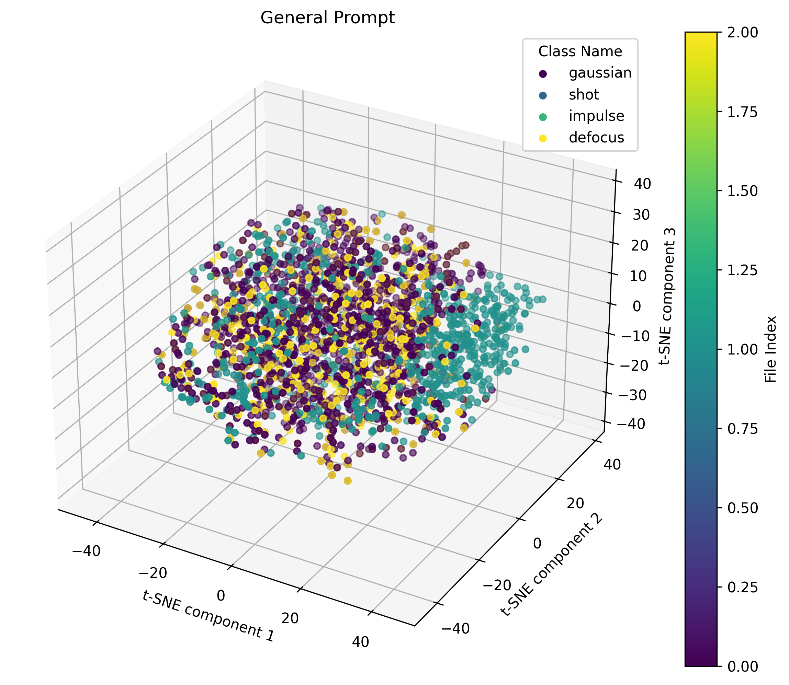

#Flat Minima Dual Prompt: Addressing Stability and Plasticity in Continual Test-Time Adaptation

This is the official project repository for [Flat Minima Dual Prompt: Addressing Stability and Plasticity in Continual Test-Time Adaptation]. This repository is built based on the [SAR 🔗](https://github.com/mr-eggplant/SAR).

<p align="center">

</p>


**Installation**:
This repository contains code for evaluation on ImageNet-C,CIFAR10-C,CIFAR100-C, ImageNet-R, VisDA-2021, ACDC with ViT.
For CIFAR10-C and CIFAR100-C, the pre-trained ViT-B model weights are from [MAE (CVPR 2024) 🔗](https://github.com/RanXu2000/continual-mae?tab=readme-ov-file)
For ImageNet-C,ImageNet-R and  VisDA-2021, the pre-trained ViT-B model weights are from timm .

**Dataset Download**:

[CIFAR100-C 🔗](https://zenodo.org/records/3555552)
[CIFAR10-C 🔗](https://zenodo.org/records/2535967)
[ImageNet-C 🔗](https://zenodo.org/records/2235448#.Yj2RO_co_mF)


**Details of ours code**:
In gnp.py, we implemented our Gradient Norm Penalty algorithm. In ./models/ours\_transformer.py, we implemented Dual Prompt. In ours.py, we implemented Representation Change Constraints.

**Details of Dual Prompt**:

$$
C(\cdot)=W_{down} \in R^{dim,r} ,W_{up} \in R^{r,dim};
$$

$$
\pi^{\ell} =C(Z^{\ell})= W_{\text{up}}(W_{\text{down}}(Z^{\ell})).
$$

$$
G(\cdot)=W_{down} \in R^{dim,r} ,W_{up} \in R^{r,dim};
E(\cdot)=W_{down} \in R^{dim,r} ,W_{up} \in R^{r,dim};
$$

$$
G_{prompt}=G(Z-\pi^{\ell});
E_{prompt}=G(\pi^{\ell});
$$

## **Correction of G_prompt Visualization Error**

**The error in the visualization of G_prompt in the paper has been corrected. The issue was caused by incorrectly importing another file instead of defocus. This has now been fixed. Thank you.**

> **Note**: This is an important update.


<div style="display: flex; justify-content: center; gap: 20px;">
  
  
</div>


**Usage in ImageNet-C**:
```
python main.py --method ours --test_batch_size 64 --lr 1e-2 --prompt_lr 1e-6 --num_classes 1000 --GNP --alpha 0.8 --rho=0.01 --device 0  --data_corruption XX
python main.py --method dct --test_batch_size 64 --lr 1e-3  --num_classes 1000 --device 0  --data_corruption XX
python main.py --method dpal --test_batch_size 64 --lr 1e-3  --num_classes 1000 --device 0  --data_corruption XX
python main.py --method sar --test_batch_size 64 --lr 1e-3  --num_classes 1000 --device 0  --data_corruption XX
python main.py --method tent --test_batch_size 64 --lr 1e-3  --num_classes 1000 --device 0  --data_corruption XX
python main.py --method cotta --test_batch_size 64 --lr 1e-4  --num_classes 1000 --device 0  --data_corruption XX
```
**Usage in ImageNet-C BATCH SIZE=1**:
```
python main.py --method ours --test_batch_size 1 --lr 1e-5 --prompt_lr 1e-7 --num_classes 1000 --GNP  --alpha 0.8 --rho=0.01 --device 0  --data_corruption XX
python main.py --method dct --test_batch_size 1 --lr 1e-3  --num_classes 1000 --device 0  --data_corruption XX
python main.py --method dpal --test_batch_size 1 --lr 1e-3  --num_classes 1000 --device 0  --data_corruption XX
python main.py --method sar --test_batch_size 1 --lr 1e-3  --num_classes 1000 --device 0  --data_corruption XX
python main.py --method tent --test_batch_size 1 --lr 1e-3  --num_classes 1000 --device 0  --data_corruption XX
python main.py --method cotta --test_batch_size 1 --lr 1e-4  --num_classes 1000 --device 0  --data_corruption XX
```


**Usage in CIFAR10-C and CIFAR100-C**:
```
python cifar_main.py --method ours --test_batch_size 32 --lr 1e-2 --prompt_lr 1e-6 --num_classes 10 --GNP --alpha 0.8 --rho 0.01 --device 0
python cifar_main.py --method ours --test_batch_size 32 --lr 1e-2 --prompt_lr 1e-6 --num_classes 100 --GNP --alpha 0.8 --rho 0.01 --device 0

python cifar_main.py --method dct --test_batch_size 32 --lr 1e-3  --num_classes 10 --device 0
python cifar_main.py --method dct --test_batch_size 32 --lr 1e-3  --num_classes 100 --device 0

python cifar_main.py --method dpal --test_batch_size 32 --lr 1e-3  --num_classes 10 --device 0
python cifar_main.py --method dpal --test_batch_size 32 --lr 1e-3  --num_classes 100 --device 0

python cifar_main.py --method sar --test_batch_size 32 --lr 1e-3  --num_classes 10 --device 0
python cifar_main.py --method sar --test_batch_size 32 --lr 1e-3  --num_classes 100 --device 0

python cifar_main.py --method tent --test_batch_size 32 --lr 1e-3  --num_classes 10 --device 0
python cifar_main.py --method tent --test_batch_size 32 --lr 1e-3  --num_classes 100 --device 0

python cifar_main.py --method cotta --test_batch_size 32 --lr 1e-4  --num_classes 10 --device 0
python cifar_main.py --method cotta --test_batch_size 32 --lr 1e-4  --num_classes 100 --device 0
```


## Acknowledgment
The code is inspired by the [DCT (MM 2024) 🔗](https://github.com/yushuntang/DCT) and [SAR (ICLR 2023) 🔗](https://github.com/mr-eggplant/SAR).
